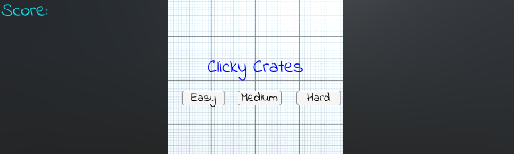
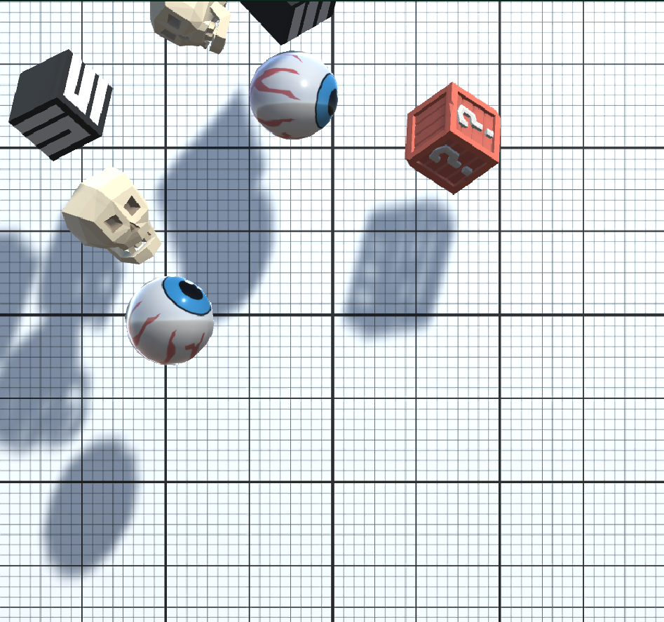

# 🎯 Unity Target Clicker Game – UI, Events & Game States

This Unity 2D project features a fun click-based gameplay experience where the player clicks on randomly launched objects to earn points. Each click triggers a visual effect, updates the score, and progresses the game. The project includes all core gameplay loop elements such as a title screen, difficulty selection, game over screen, and restart functionality. Through this project, you'll learn how to manage UI systems, mouse events, scene transitions, and game states in Unity.

---

## 📸 Screenshots

### 🎮 Game View:

### 🛠️ Scene View:

---

## 🎮 Gameplay Summary

- 🎲 Objects are launched upward with random position, speed, and spin
- 🖱️ The player clicks on these objects to destroy them and earn points
- 💥 A particle explosion effect is triggered on every successful hit
- ⏱️ Launch speed varies depending on the selected difficulty
- 🎯 The player's score is displayed on screen
- ❌ The game ends under certain conditions, and a "Game Over" screen appears
- 🔁 The game can be restarted via a restart button

---

## ✨ Key Features

### 🧠 Game Mechanics
- Objects are launched using `Rigidbody2D.AddForce()` and `AddTorque()`
- Random values for position, force, and torque are generated using `Random.Range()`
- `OnMouseDown()` detects mouse clicks on target objects
- Objects are removed using `Destroy()`
- Visual feedback is provided via `ParticleSystem` effects

### 📊 Scoring System
- Score increases when a target is successfully hit
- `TextMeshProUGUI` is used to update the score on screen
- A dedicated `GameManager` script handles score tracking
- Score increments are triggered via a `CustomMethod(int value)`

### 🖥️ UI & Game States
- UI elements are organized using **Canvas**, **Anchor Points**, and grouping
- Seamless transitions between title screen, difficulty selection, and game over screen
- **Buttons** with `OnClick()` events handle user interaction
- Functions are assigned to buttons using `AddListener()` with parameters
- Game state is tracked using a `bool isGameActive` variable
- The game restarts using `SceneManager.LoadScene()`

---

## 🗂️ Project Structure
